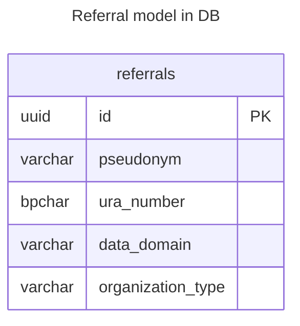

# GFModules National Referral Index (NRI) or Nationale Verwijs Index (NVI)

The National Referral Index (NRI) is responsible for the referral of the Health Data. The NRI contains a referral
to the register that associates a Health Provider with pseudonym and data domain.

## Disclaimer

This project and all associated code serve solely as documentation
and demonstration purposes to illustrate potential system
communication patterns and architectures.

This codebase:

- Is NOT intended for production use
- Does NOT represent a final specification
- Should NOT be considered feature-complete or secure
- May contain errors, omissions, or oversimplified implementations
- Has NOT been tested or hardened for real-world scenarios

The code examples are only meant to help understand concepts and demonstrate possibilities.

By using or referencing this code, you acknowledge that you do so at your own
risk and that the authors assume no liability for any consequences of its use.

## Usage

The application is a FastAPI application, so you can use the FastAPI documentation to see how to use the application.

## Getting started

You can either run the application natively or in a docker container. If you want to run the application natively you
can take a look at the initialisation steps in `docker/init.sh`.

The preferred way to run the application is through docker.

Start the docker compose from gfmodules-coordination when running this app as part of the overarching
gfmodules-coordination project. For full stack setup details, see the [gfmodules development readme.](https://github.com/minvws/gfmodules-coordination?tab=readme-ov-file#generic-functions-modules-generieke-functies-modules)

If you run Linux, make sure you export your user ID and group ID to synchronize permissions with the Docker user.

```bash
export NEW_UID=$(id -u)
export NEW_GID=$(id -g)
```

After this you can simply run `docker compose up`.

The application will be available at `http://localhost:8501` when the startup is completed.

## Interface Definitions

See [interface definitions](docs/interface-definitions/README.md)

## Models



Explanation of fields:

- `pseudonym`: The pseudonym of the patient whose referral is being stored.
- `ura_number`: The URA number associated with healthcare provider that registered the referral.
- `data_domain`: The care context of the referral, e.g., 'MedicationAgreement', 'AllergyIntolerance', etc.
- `organization_type`: The type of organization that registered the referral, e.g., 'huisarts', 'ziekenhuis', etc.

## Docker container builds

There are two ways to build a docker container from this application. The first is the default mode created with:

```bash
    make container-build
```

This will build a docker container that will run its migrations to the database specified in app.conf.

The second mode is a "standalone" mode, where it will not run migrations, and where you must explicitly specify
an app.conf mount.

```bash
    make container-build-sa
```

Both containers only differ in their init script and the default version usually will mount its own local src directory
into the container's /src dir.

## Contribution

As stated in the [Disclaimer](#disclaimer) this project and all associated code serve solely as documentation and
demonstration purposes to illustrate potential system communication patterns and architectures.

For that reason we will only accept contributions that fit this goal. We do appreciate any effort from the
community, but because our time is limited it is possible that your PR or issue is closed without a full justification.

If you plan to make non-trivial changes, we recommend to open an issue beforehand where we can discuss your
planned changes. This increases the chance that we might be able to use your contribution
(or it avoids doing work if there are reasons why we wouldn't be able to use it).

Note that all commits should be signed using a gpg key.

When starting to introduce changes, it is important to leave user specific files such as IDE or text-editor settings
outside the repository. For this, create an local `.gitignore` file and configure git like below.

```bash
git config --global core.excludesfile ~/.gitignore
```
