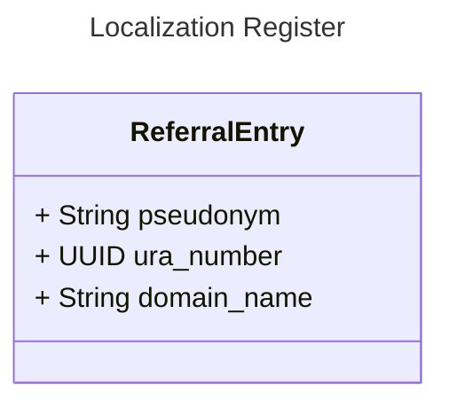

# GFModules National Referral Index (NRI) or Nationale Verwijs Index (NVI)

The National Referral Index (NRI) is responsible for the referral of the Health Data. The NRI contains a referral
to the register that associates a Health Provider with pseudonym and data domain.

## Usage

The application is a FastAPI application, so you can use the FastAPI documentation to see how to use the application.

## Getting started

You can either run the application natively or in a docker container. If you want to run the application natively you
can take a look at the initialisation steps in `docker/init.sh`.

The preferred way to run the application is through docker.

Before you start this docker compose project, make sure you have the gfmodules-coordination docker compose
project running. For more information about setting up the whole project stack, read the gfmodules development
[readme](https://github.com/minvws/gfmodules-coordination?tab=readme-ov-file#development)

If you run Linux, make sure you export your user ID and group ID to synchronize permissions with the Docker user.

```bash
export NEW_UID=$(id -u)
export NEW_GID=$(id -g)
```

After this you can simply run `docker compose up`.

The application will be available at `https://localhost:8501` when the startup is completed.

## Interface Definitions

See [interface definitions](docs/interface-definitions/README.md)

## Models



## Contribution

When starting to introduce changes, it is important to leave user specific files such as IDE or text-editor settings
outside the repository. For this, create an local `.gitignore` file and configure git like below.

```bash
git config --global core.excludesfile ~/.gitignore
```
