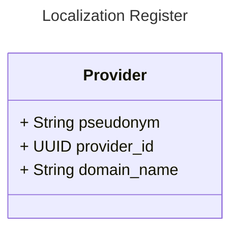

### GFModules National Referral Index (NRI) or Nationale Verwijs Index (NVI)

The National Referral Index (NRI) is responsible for the referral of the Health Data. The NRI contains a referral
to the register that associates a Health Provider with pseudonym and data domain.


## First run

If you need to run the application without actual development, you can use the autopilot functionality. When this
repository is checked out, just run the following command:

```bash
make autopilot
```

This will configure the whole system for you and you should be able to use the API right away at http://localhost:8502/docs


## Usage

The application is a FastAPI application, so you can use the FastAPI documentation to see how to use the application.

## Development

Build and run the application

Firstly, copy the `app.conf.example` to `app.conf` and adjust values when needed.
If you run Linux, make sure you export your user ID and group ID to synchronize permissions with the Docker user.

export NEW_UID=$(id -u)
export NEW_GID=$(id -g)

When you're ready, build the application with: make container-build.

Run make up to start the application.


## Models


